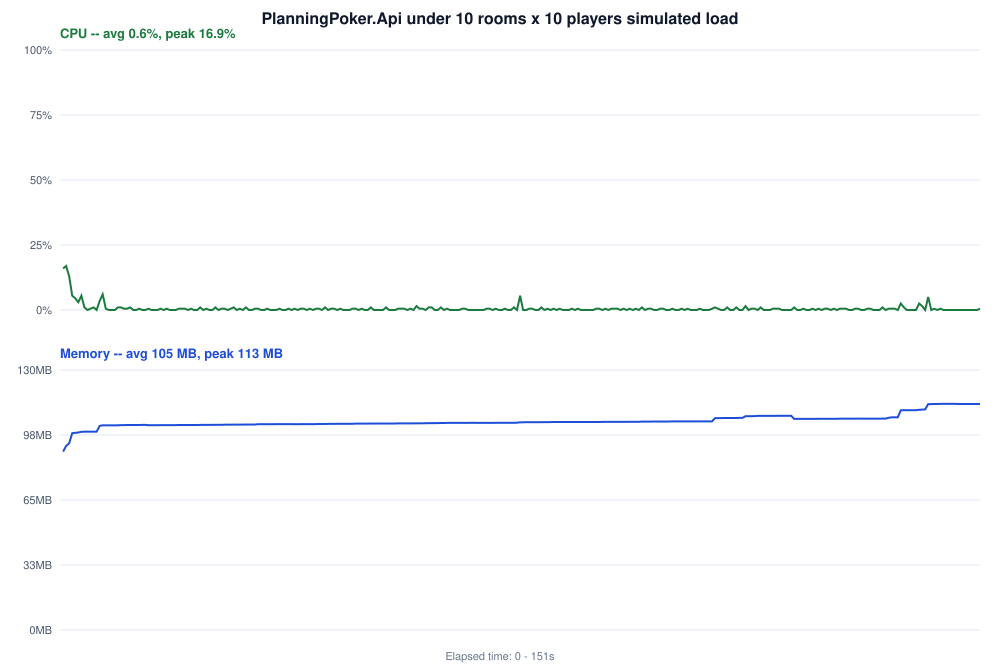

<div align="center">
  

  # Planning Poker

  <em>Real-time, self-hosted Planning Poker for agile estimation.</em>

  [](https://github.com/GVLTodorov/PlanningPoker/actions/workflows/ci.yml)

  
</div>

---

## Table of Contents

- [What is this?](#what-is-this)
- [Features](#features)
- [Quick start](#quick-start)
- [Tech stack](#tech-stack)
- [Project structure](#project-structure)
- [Testing](#testing)
- [Performance](#performance)
- [Configuration](#configuration)

## What is this?

A single-container web app for running Planning Poker sessions: create a room, share a link,
pick cards together, and reveal everyone's estimate at once — all over a real-time connection, no
sign-up required. It's a from-scratch .NET/Blazor WebAssembly rebuild of the business rules from
[axeleroy/self-host-planning-poker](https://github.com/axeleroy/self-host-planning-poker), with a
few deliberate changes (see [REQUIREMENTS.MD](REQUIREMENTS.MD) for the full spec this was built
against).

## Features

- **Create or join a room** in seconds — a friendly room-name suggestion is generated for you, and
  joining via a shared link takes one form submit (Enter works, no extra click).
- **Five decks** to estimate with: Fibonacci, Modified Fibonacci, Powers of 2, Trust Vote, and
  T-Shirt Sizes — picked once when the room is created and fixed for its lifetime.
- **Real-time board**: see who has picked (without seeing their pick) until everyone reveals
  together. Reveal is only available once every non-spectator has picked, enforced by the server,
  not just a disabled button.
- **Spectator mode** for anyone who wants to watch without voting.
- **Giphy-powered avatars** — five random avatars to choose from when you join, with a refresh
  button to fetch a new batch. Fully optional: the app runs cleanly with no Giphy features when
  unconfigured.
- **Accessible-by-default styling**: a green palette, large fonts, and generous touch targets
  aimed at comfortable use for players of any age.

## Quick start

### Local (.NET)

Requires the [.NET 10 SDK](https://dotnet.microsoft.com/download) (the exact version is pinned in
[global.json](global.json)).

```bash
dotnet run --project PlanningPoker.Api
```

This builds the Blazor client, hosts it as static files, and serves the API/real-time hub from the
same process. Open the URL printed in the console (e.g. `http://localhost:6232`).

Debugging from VS Code: open the repo folder and press **F5** — [.vscode/launch.json](.vscode/launch.json)
is already wired up to build and launch `PlanningPoker.Api`.

### Docker

```bash
docker compose up --build
```

Serves the app on [http://localhost:8140](http://localhost:8140) (see
[docker-compose.yml](docker-compose.yml)). See [Configuration](#configuration) below for the
optional Giphy environment variables.

## Tech stack

.NET (ASP.NET Core Minimal API) + Blazor WebAssembly, one language end-to-end, single container
image, no separate JS/npm toolchain. Real-time state (join/pick/reveal/reset) is pushed over
SignalR with a source-generated JSON payload; REST endpoints handle room creation/lookup, deck
metadata, and the Giphy avatar proxy.

## Project structure

The solution ([PlanningPoker.slnx](PlanningPoker.slnx)) sits at the repo root; every project lives
under `src/`, one folder per project, split along dependency lines:

```
src/PlanningPoker.Infrastructure/     Domain rules (Room/Player/Deck, no ASP.NET dependency) + wire
                                       request/response models and the JSON source-gen context,
                                       shared by Api and Client
src/PlanningPoker.Api/                Minimal API + SignalR hub + Giphy client; hosts the Client's
                                       output
src/PlanningPoker.Client/             Blazor WebAssembly frontend
src/PlanningPoker.Tests.Unit/         xUnit: domain logic, deck values, Giphy client, JSON round-trips
src/PlanningPoker.Tests.Component/    bUnit: Blazor component behavior
src/PlanningPoker.Tests.Integration/  WebApplicationFactory + a real SignalR client, full hub flow
src/PlanningPoker.Tests.Benchmarks/   BenchmarkDotNet: domain hot paths, JSON serialization, Giphy
                                       cache
src/PlanningPoker.Tests.LoadTest/     Console tool: N rooms x M players, reports pick/reveal latency
src/PlanningPoker.Tests.Play/         Playwright: joins, picks, reveals, and resets a room through
                                       the real UI -- records the demo video above
src/PlanningPoker.Tests.Play.Twelve/  Same as Play, scaled to 12 players -- records docs/twelve.gif
src/PlanningPoker.Tests.Play.Hundred/ Console tool: 10 rooms x 10 players over real SignalR
                                       connections (no browser), samples the API's own CPU/memory
                                       while they vote -- draws docs/hundred-resource-usage.svg
```

The Client depends only on Contracts — never Domain — so the browser bundle never ships
server-side validation logic or knows how the Giphy integration works (its API key never leaves
the server).

## Testing

```bash
dotnet test PlanningPoker.slnx
```

Runs the unit, component, and integration suites together. The [CI workflow](.github/workflows/ci.yml)
runs the same command on every push/PR and gates the version-bump/image-build/push job on it
passing. It also collects code coverage and publishes an HTML report (the `coverage-report`
artifact) plus a summary in the job summary — informational only, not gated on a threshold.
Performance checks (`PlanningPoker.Tests.Benchmarks`, `PlanningPoker.Tests.LoadTest`, and the bundle
size check in CI) are run separately and don't gate every commit — see REQUIREMENTS.MD Section 10.3.

The demo video above is produced by `PlanningPoker.Tests.Play`, a Playwright-driven browser
simulation (5 players join, vote, reveal, reset, and vote again). It's not part of `dotnet test` —
run it manually against a live instance (`dotnet run --project PlanningPoker.Tests.Play -- http://localhost:6232`),
or trigger the [Demo Video workflow](.github/workflows/demo-video-5p.yml) from the Actions tab to
regenerate and commit `docs/demo.gif`. That workflow needs `GIPHY_API_BASE_URL`/`GIPHY_API_QUERY`
configured as repo secrets to show real gifs. The same pattern, scaled to 12 players, is the
[Demo Video (12 Players) workflow](.github/workflows/demo-video-12p.yml), producing
`docs/twelve.gif`. All three demo workflows (this one, the 12-player one, and the load test below)
can also be run back-to-back in a single Actions run via the
[Demo All (Sequential) workflow](.github/workflows/demo-all.yml), which calls each as a reusable
workflow chained with `needs:` so they run one at a time. Each job's own checkout is still pinned to
the SHA the overall run started from, though, so an earlier job's push isn't visible yet by the time
a later job commits — every job's commit step runs `git pull --rebase origin main` right before
`git push` to pick that up.

## Performance



`PlanningPoker.Tests.Play.Hundred` drives 10 rooms x 10 players (100 real SignalR connections, no
browsers) voting at a human pace — each room's pick/reveal/reset round takes 15-20 wall-clock
seconds, with picks landing at random moments rather than all at once — while sampling
`PlanningPoker.Api`'s own CPU% and working-set memory. It exists purely to see what the app costs
under sustained concurrent load. Trigger the
[Demo Load workflow](.github/workflows/demo-load-100p.yml) from the Actions tab to regenerate and
commit the chart above, or run it manually against a live instance:

```bash
dotnet run --project PlanningPoker.Tests.Play.Hundred -- http://localhost:6232 <api-pid> docs/hundred-resource-usage.svg
```

## Configuration

Two optional environment variables enable the Giphy integration (the avatar picker). If either is
unset, avatars simply don't render — nothing else breaks.

| Variable              | Example                                                                |
|------------------------|-------------------------------------------------------------------------|
| `GIPHY_API_BASE_URL`   | `https://api.giphy.com/v1/gifs/trending?api_key=YOUR_GIPHY_API_KEY`    |
| `GIPHY_API_QUERY`      | `limit=10&offset=0&rating=g&lang=en`                                   |

`GIPHY_API_BASE_URL` must point at `.../trending`, not `.../search` — see the gotcha noted in
[REQUIREMENTS.MD Section 4.3](REQUIREMENTS.MD#43-operational-endpoints).

### Getting a Giphy API key

1. Create a free account at [developers.giphy.com](https://developers.giphy.com).
2. From the [dashboard](https://developers.giphy.com/dashboard/), click **Create an App** → pick
   the free **API** (not SDK) option, and give it any name.
3. Copy the generated API key into `GIPHY_API_BASE_URL` as shown above.

Never commit a real Giphy API key — set it only as an environment variable at deploy time.

### Running it with Docker Compose

[docker-compose.yml](docker-compose.yml) at the repo root is the minimal, portable example — build
locally, no reverse proxy required:

```yaml
services:
  planningpoker:
    image: ghcr.io/gvltodorov/planningpoker:latest
    build:
      context: .
      dockerfile: Dockerfile
    container_name: planningpoker
    restart: unless-stopped
    ports:
      - 8140:8080
    environment:
      - GIPHY_API_BASE_URL=https://api.giphy.com/v1/gifs/trending?api_key=YOUR_GIPHY_API_KEY
      - GIPHY_API_QUERY=limit=10&offset=0&rating=g&lang=en
```

Behind a reverse proxy (this is how the live instance at
[poker.devspace.tech](https://poker.devspace.tech) actually runs — Traefik terminating TLS and
routing by hostname), drop the `ports` mapping and add routing labels instead:

```yaml
services:
  planningpoker:
    image: ghcr.io/gvltodorov/planningpoker:latest
    container_name: planningpoker
    restart: unless-stopped
    environment:
      - GIPHY_API_BASE_URL=https://api.giphy.com/v1/gifs/trending?api_key=YOUR_GIPHY_API_KEY
      - GIPHY_API_QUERY=limit=10&offset=0&rating=g&lang=en
    labels:
      - "traefik.enable=true"
      - "traefik.http.routers.planningpoker.rule=Host(`poker.example.com`)"
      - "traefik.http.routers.planningpoker.entrypoints=https"
      - "traefik.http.routers.planningpoker.tls.certresolver=myresolver"
    networks:
      - proxy

networks:
  proxy:
    external: true
```
